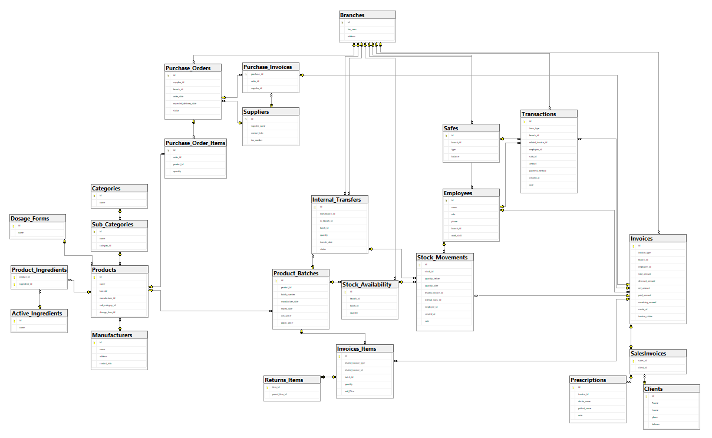

# 💊 Pharmacy Management System (Simple ERP)

scalable SQL Server database engine designed for modern pharmacy chains. This system implements pharmaceutical business logic, multi-branch inventory synchronization, and financial auditing.

---

  

## 🏗️ Project Architecture & Modules

### 📂 File Structure Overview

| File / Folder | Responsibility |
| :--- | :--- |
| **`Tables.sql`** | Core Schema: Implements DDL for Organization, Products, Inventory, and Finance. |
| **`Core_Business_Logic/`** | **The Brain:** 5 specialized files containing SPs for CRUD and complex business workflows. |
| **`Table-Valued Parameter.sql`**| Bulk Data Handling: Custom types (UDTTs) for processing multi-item. |
| **`Functions.sql`** | Reusable Logic: Stock calculations, currency formatting, and expiry status logic. |
| **`Views.sql`** | Reporting Layer: Abstracted views for Audit trails, Stock status, and Financial summaries. |
| **`Trigger.sql`** | Integrity Layer: Automated stock adjustments and safety constraints. |
| **`Indexes.sql`** | Performance Tuning: Optimized indexing for Barcodes, Batches, and Expiry dates. |
| **`Analytical Queries.sql`**| BI Layer: procedures and views for sales trends and branch performance analysis. |
| **`Virtual Data.sql`** | Seeding: Scripts to populate the database with realistic testing data. |

  

## 📂 Data Dictionary & System Relationships

This section details the relational structure and the logic behind each module.

### 🏛️ 1. Organization
*Manages physical pharmacy locations, staff roles, and financial containers.*

| Table | Purpose | Relationships & Logic |
| :--- | :--- | :--- |
| **`Branches`** | Multi-location management. | Root parent for Employees, Safes, and Stock. |
| **`Employees`** | Staff registry & shifts. | Linked to `Branches`. Responsible for `Invoices` & `Transactions`. |
| **`Safes`** | Cash containers (Main/Till). | Linked to `Branches`. Balance is affected by `Transactions`. |

### 💊 2. Advanced Product Module
*A granular approach to pharmaceutical data, supporting molecular-level substitution.*

| Table | Purpose | Relationships & Logic |
| :--- | :--- | :--- |
| **`Manufacturers`** | Production companies. | Linked to `Products`. |
| **`Categories`** | Top-level classifications. | Parent to `Sub_Categories`. |
| **`Sub_Categories`** | Granular grouping. | Linked to `Products`. |
| **`Active_Ingredients`**| Chemical compounds. | Linked to `Product_Ingredients` for medical matching. |
| **`Dosage_Forms`** | Physical drug forms. | Linked to `Products` (e.g., Tablets, Syrups). |
| **`Products`** | The central catalog. | Junction point for Manufacturers, Categories, and Forms. |
| **`Product_Ingredients`**| Scientific mapping. | **Junction Table:** Many-to-Many between `Products` & `Ingredients`. |

### 📦 3. Inventory & Batches
*Handling the lifecycle of stock from manufacturing to the pharmacy shelf.*

| Table | Purpose | Relationships & Logic |
| :--- | :--- | :--- |
| **`Product_Batches`** | Batch-specific pricing/expiry.| Linked to `Products`. Fundamental unit for all stock moves. |
| **`Stock_Availability`**| Real-time branch quantity. | Unique per `(branch_id, batch_id)`. |
| **`Internal_Transfers`**| Cross-branch logistics. | Records "From" and "To" branches with status tracking. |
| **`Stock_Movements`** | Immutable Audit Log. | Tracks Before/After quantities for every transaction. |

### 🧾 4. Unified EERD Invoicing & Movements
*The core engine handling Sales, Purchases, and Returns in a centralized flow.*

| Table | Purpose | Relationships & Logic |
| :--- | :--- | :--- |
| **`Invoices`** | Parent header (The Base). | Uses `invoice_type` discriminator ('S','P','R') for sub-types. |
| **`Invoices_Items`** | Transactional line items. | Linked to `Product_Batches`. Triggers `Stock_Movements`. |
| **`Returns_Items`** | Reverse logistics. | Tracks returns against original sales (Self-referencing). |
| **`Prescriptions`** | Medical documentation. | Linked to `SalesInvoices` for controlled drug tracking. |

### 🤝 5. Procurement (Supply Chain)
*Managing vendor relationships and the pre-purchase order lifecycle.*

| Table | Purpose | Relationships & Logic |
| :--- | :--- | :--- |
| **`Suppliers`** | Vendor profiles & tax IDs. | Linked to `Purchase_Orders` and `Purchase_Invoices`. |
| **`Purchase_Orders`** | Official stock requests. | Linked to `Suppliers` & `Branches`. Tracks order status. |
| **`Purchase_Order_Items`**| Order line items. | Linked to `Products` (Items requested but not yet received). |
| **`Purchase_Invoices`**| Received shipments. | **Sub-type of Invoices:** Links `Invoices` to `Purchase_Orders`. |

### 💰 6. Sales, Clients & Financials
*Tracking customer debt and every penny moving in or out of the safes.*

| Table | Purpose | Relationships & Logic |
| :--- | :--- | :--- |
| **`Clients`** | Customer database. | Tracks balances for credit sales. Linked to `SalesInvoices`. |
| **`SalesInvoices`** | Consumer sales records. | **Sub-type of Invoices:** Links `Invoices` to `Clients`. |
| **`Transactions`** | The ultimate cash log. | Links `Invoices` to `Safes` via `Employees`. |

---

## 📌 Features

- **Inventory Management:** Track stock levels, batches, expiry dates, and slow-moving products.  
- **Sales & Returns:** Manage sales invoices, returns, and top-selling products.  
- **Purchasing & Suppliers:** Monitor purchase orders, suppliers, and pending deliveries.  
- **Finance & Cashflow:** Manage safes, cash transactions, and branch financial summaries.  
- **Employee Management:** Track employee performance and KPI reports.  
- **Analytical Insights:** Ready-to-use views and procedures for reporting and decision-making.

<!--
---
## 📊 Analytical Insights

The system provides ready-to-use analytical views and procedures for inventory, sales, finance, and employee performance:

### **Inventory & Stock**
- **vw_ProductFullDetails:** Complete product info (name, barcode, dosage, category, sub-category, manufacturer).  
- **vw_DetailedStock:** Current stock per branch with batch numbers and expiry dates.  
- **vw_Current_Inventory:** Total available quantity of each product per branch with manufacturer.  
- **vw_Expiring_Soon:** Batches expiring within 90 days.  
- **vw_Slow_Moving_Products:** Products not sold in the last 6 months.  
- **vw_StockAuditTrail:** Full stock movement history linked to invoices or responsible employees.  
- **vw_InternalTransferLogs:** Track transfers between branches with quantity, status, and timestamps.

### **Sales & Returns**
- **vw_SalesDetails:** Sales invoices with client, employee, totals, and timestamps.  
- **pr_Sales_Summary:** Daily or monthly total sales and net profit.  
- **Top_Selling_Products:** Top 10 products by sales per branch.  
- **Returns_Percentage:** Percentage of returns relative to total sales.

### **Purchases & Suppliers**
- **vw_PurchaseSummary:** Purchase invoices with supplier details.  
- **vw_Pending_Purchase_Orders:** Purchase orders not yet received and delayed.  

### **Finance & Cashflow**
- **vw_SafeTransactions:** Cash movements per safe with amounts, employee, and timestamps.  
- **Cash_Flow_Report:** Detailed inflow/outflow of a specific safe in the last 24 hours.  
- **vw_BranchFinancialSummary:** Branch-level summary (sales, purchases, expenses, returns).  
- **vw_Client_Debts:** Clients with outstanding balances.

### **Employee Performance**
- **vw_EmployeeActivity:** Employee KPIs (invoices issued, total amounts in/out).

-->
---

## 👤 Contact

- **LinkedIn:** [Mohamed Bashar](https://www.linkedin.com/in/mohamed-nabil-bashar)  
- **GitHub:** [Mohamed Bashar](https://github.com/Mohamed-n-Bashar)

---

*If you find this project useful, don't forget to give it a ⭐ on GitHub!*
